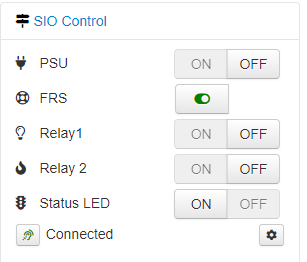
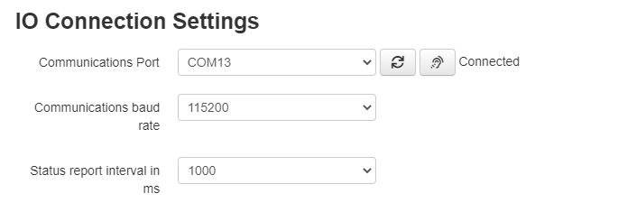
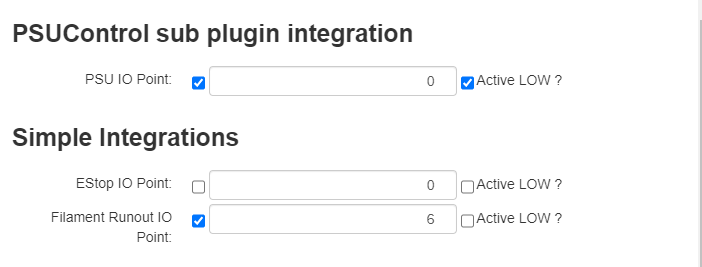
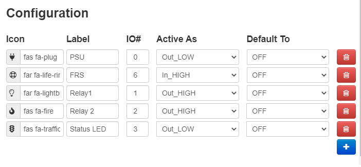

# OctoPrint-Siocontrol
The Serial IO Control OctoPrint plugin, Adds a sidebar with on/off buttons for controlling of Outputs and monitoring of Inputs. It is also a SubPlugin for integration with PSU control, incorporates a physical EStop and simple Filament runout sensor. Serves as an alterative IO control for users that are not using a Raspberry Pi or other device that can take advantage local IO. Requires a Microcontroller as the IO.

With the Serial IO Control and an inexpensive Micro controller you can add Serial IO 
to any OctoPrint instance. Use a micro controller like the 
Esp8266/ESP32, Arduino Mega, Nano or some other MCU capable of Serial communications. 

Use the micro controllers Digital IO from within the Octoprint interface. An alternative to using GPIO/local IO on a Raspberry Pi like device. Great for Windows users as well as users of other linux devices that do not have native IO like the Raspberry Pi. 

Some hardware suggestions are listed at the end of this document.

## Setup

Install via the bundled [Plugin Manager](https://docs.octoprint.org/en/master/bundledplugins/pluginmanager.html)
or manually using this URL:

    https://github.com/jcassel/OctoPrint-Siocontrol/archive/master.zip

## Getting Started
First you should choose the IO controller and ensure it is working as expected. Ensure you know what IO numbers are setup as Inputs and Outputs. Once ready continue on. If you are not sure on this topic, there are some hardware options listed at the bottom that require little to no knowlege of programing an MCU.

Before you plug in your IO device, you should ensure that you can connect to your printer. Make note of the port that your printer is on. The SIOControl can sometimes be mistken by OctoPrint as a printer. 

## Configuration

### Serial Connection

							   

Configure the Serial Port Details. (Enter the settings dialog for the SIOControl PlugIn) 
- Port Path(Linux) or Port Name(Windows). You may need to hit refresh to see the new port for your IO. 
- Baud rate (default firmware is 115200)  
- Sensing/reporting interval (default is 3000ms (3 seconds)). There should be no problem setting this higher or lower. Higher interval is good if you have a slower PC. Keep in mind that the IO Device will report on any changes in the state of the IO so even when the interval is high, you should not miss any transitions. 
- Push the connect button at the right of the Port selection. This will use the settings to try to connect. If it fails to connect, check your USB connection and ensure that your selecting the correct port. 
Save these settings check in the lower left navigation pain. It should now say "Connected". If not you may not have put in the correct connection details. You can now reopen the SIO setting and assign the rest of the details as needed. 

### Integrations 

Simple selections for integrations (Optional)
- Enable and select IO point for PSU Control Sub Plugin.
- Enable and select IO point for physical EStop.
- Enable and select IO point for Filament runout sensor.

### IO Configuration

As you add SIO configurations they will appear on the side bar for interaction and monitoring:
- select icon using icon picker (or typing manually) for easy identification
- Type in a short name for the device connected to the IO Pin
- Select the IO number for your IO point. Note that the available numbers just a list of numbers, if you select a IO number that does not exist, you will get an error message. 
- Select if device an Input or an Output and what is its active state.
  - Out_HIGH means that this Pin is an output and its resting state is LOW. When turned on, it will go HIGH (To V+).
  - In_LOW means that this is an input and its resting state is HiGH. When it is turned on it will go LOW(To ground).
- select if IO point should be on or off by default after/on startup.(Only applies to Outputs)
  - Off would mean that no command will be sent to the IO after start up. 
  - On would cause a command to set the Pin to its active level after start up of OctoPrint.

### Note:
Configuration of a IO Point makes it accessible in the sideNav. It is ok if the IO Point is used by the other integrations like PSUCorol. Inputs and outputs not configured at the device level from within OctoPrint. Misconfiguring a Pin in the interface will not change the pins type in the controller. To set the pins IO type see the directions for that device. The official example firmware repositories all have some general instructions on how to set IO point types either in the device code or as part of the readme. 

IO Point numbers and configurations must match the IO device firmware setup. The [OctoPrint-Serial IO Board](https://www.tindie.com/products/softwaresedge/octoprint-serial-io-kit/) offered on Tindie has 2 relays, 1 Status LED, 4 designated inputs and 6 other IO points that can be setup as either inputs or outputs. 

## 
## Hardware options
The number of IO and use case is configurable in the firmware of the micro controller. The serial protocol used is simple and can be ported to just about any micro controller with ease. There are several examples of firmware that can be used as is or adjusted to your needs. There are also several off the shelf IO board kits that can be purchased if you do not want to design and build one yourself.

### There are a few options over on Tindie if you want something more or less ready to go. 
- [2 Channel Relay board](https://www.tindie.com/products/softwaresedge/octoprint-siocontrol-2-relay-module/)
- [Plug and play 2 Channel Relay board Kit with up to 11 other IO points](https://www.tindie.com/products/softwaresedge/octoprint-serial-io-kit/)
- [4 Channel Relay board](https://www.tindie.com/products/softwaresedge/octoprint-siocontrol-4-relay-module/)

### Or you can also do it more DIY with options like these. 
- [CANADUINO PLC MEGA328](https://www.amazon.com/dp/B085F3YRK4) with 6 relay outputs and 4 digital inputs. This board can be a great option having both inputs and outputs,although pricy for what you get and it also does not come assembled. Meaning it requires a lot of soldering.  
- One could aslo adapt things to work with the standard Arduino Mega2560 plus PKA05Shield  Take a look at the example firmware. [Octoprint_SIOControl_Firmware repository](https://github.com/jcassel/OctoPrint_SIOControl_Firmware) to just about any arduino device. 

## Recognition of reference works
Thank you to the other plugin developers doing great work in this space. 

- [GpoiControl(@catgiggle)](https://github.com/catgiggle/OctoPrint-GpioControl) A lot of the initial code for this was directly pulled from GPIO Control as a starting point.
- [PSUControl(kantlivelong)](https://github.com/kantlivelong/OctoPrint-PSUControl) A well known and well used bit of code that I knew I could rely on as a good example of what to do.
- [jneilliii](https://github.com/jneilliii) so many great Plugins. The BedLevelVisualizer specifically was very helpful in working out how to deal with core ViewModels. 

